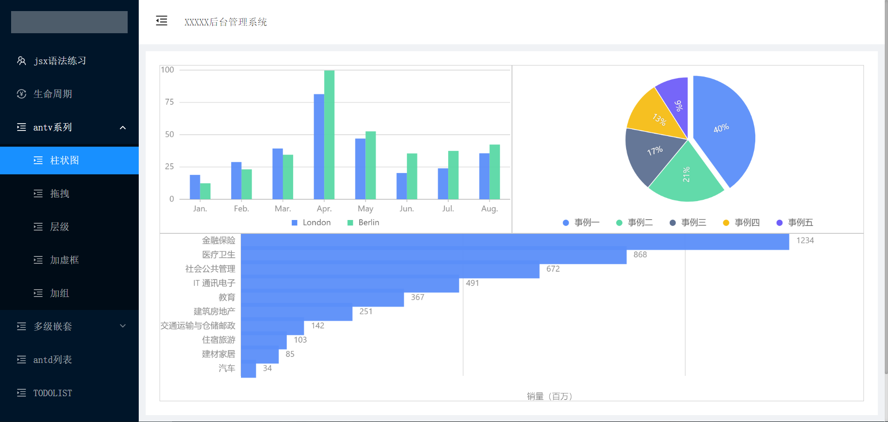

<!--
 * @Descripttion: 
 * @version: 
 * @Author: lzy
 * @Date: 2021-04-12 15:29:50
 * @LastEditors: Andy
 * @LastEditTime: 2021-05-11 11:35:18
-->
## 基于React+antd实现后台模板

学习过程参考资料：
[核心思想](https://segmentfault.com/a/1190000012052941)
[生命周期详细](https://www.jianshu.com/p/b331d0e4b398)
[绑定事件的方法](https://segmentfault.com/a/1190000011317515)
[添加样式的四个方法](https://www.cnblogs.com/zcy9838/p/12023168.html)
[父子传值的方法](https://www.jb51.net/article/162396.htm)
[使用antd引入样式报错](https://www.cnblogs.com/wspblog/p/10457512.html)
[全局引入scss](https://blog.csdn.net/chiuwingyan/article/details/78639542?utm_medium=distribute.pc_relevant.none-task-blog-2%7Edefault%7EBlogCommendFromMachineLearnPai2%7Edefault-1.control&dist_request_id=1331303.8438.16182848848559347&depth_1-utm_source=distribute.pc_relevant.none-task-blog-2%7Edefault%7EBlogCommendFromMachineLearnPai2%7Edefault-1.control)
[创建组件的三种方式](https://www.cnblogs.com/wonyun/p/5930333.html)
[基本面题](https://www.cnblogs.com/bzsheng/p/12690480.html)
[路由传参](https://www.jianshu.com/p/7ad7ab2745af)
[配置路由表方法](https://www.jianshu.com/p/677433245697)
[本地git链接github](https://blog.csdn.net/sihai12345/article/details/72379831)

以下为项目学习内容↓
> 开发登录页（使用sessionStorage模拟用户登录）

> jsx语法练习，生命周期执行规则 

> antv调研，包括X6,G6,G2，页面内使用了路由嵌套 

> antd调研 包含分页列表的案例 

> todoList经典综合案例（组件化开发） 

> webpack 的基本配置 

> axios 封装处理 

> Mock.js 模拟数据 

> 封装路由表自动生成侧边栏 

> redux

### 技术栈
react + webpack + redux + router + axios + mockJs + antv + antd +  ...
### 项目截图

### 项目结构

```
```

### 使用方法

```npm
git clone https://github.com/er345ssdlh/react-.git

// 安装依赖
cnpm i

// 启动
npm run dev

// 打包
npm run build

```